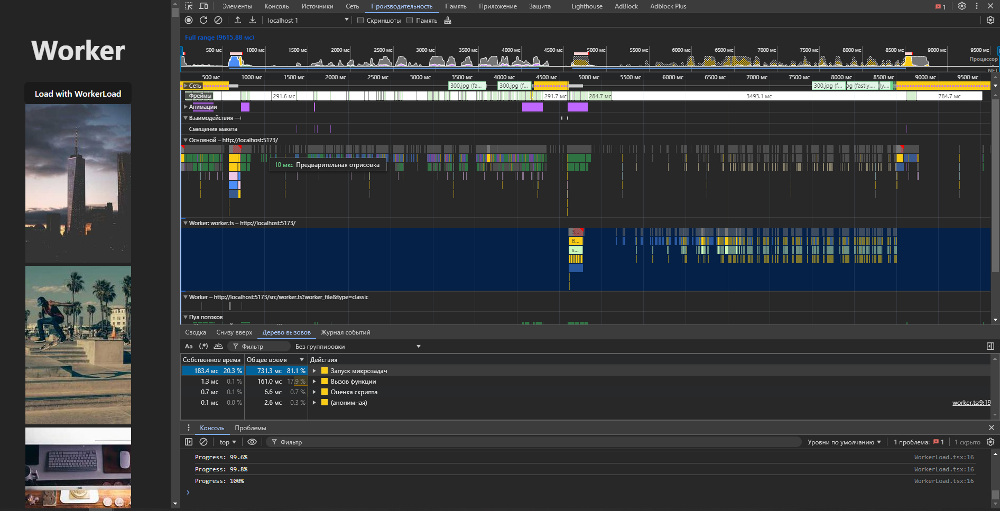

вставка изображений просто напрямую 

```
useEffect(() => {
        if (containerRef.current) {
            let images = ''

            for (let i = 0; i < imageUrls.length; i++) {
                images += ``
            }

            containerRef.current.innerHTML = images

            console.log(images)
        }
        console.log(imageUrls)
    }, []);
```


## Замеры performance
первая половина выполняется в главном потоке, а остальное выполняется в воркере
При использовании воркера поток остаётся свободным. Мы получем большой Idle фрейм на 3500ms. В это время основной поток 
свободен для других вычислений. Плюс в примере картинки попадают на страницу после загрузки всех и появляются одноверменно



